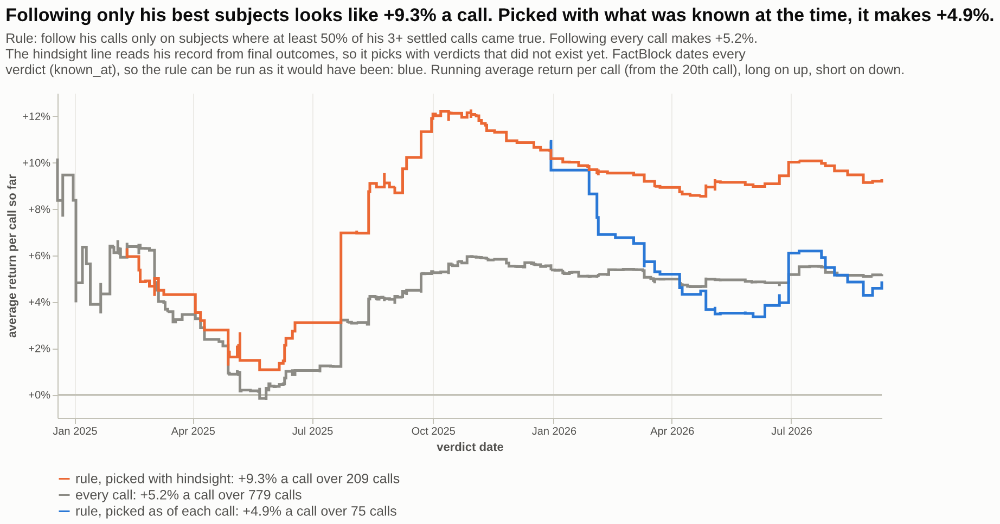
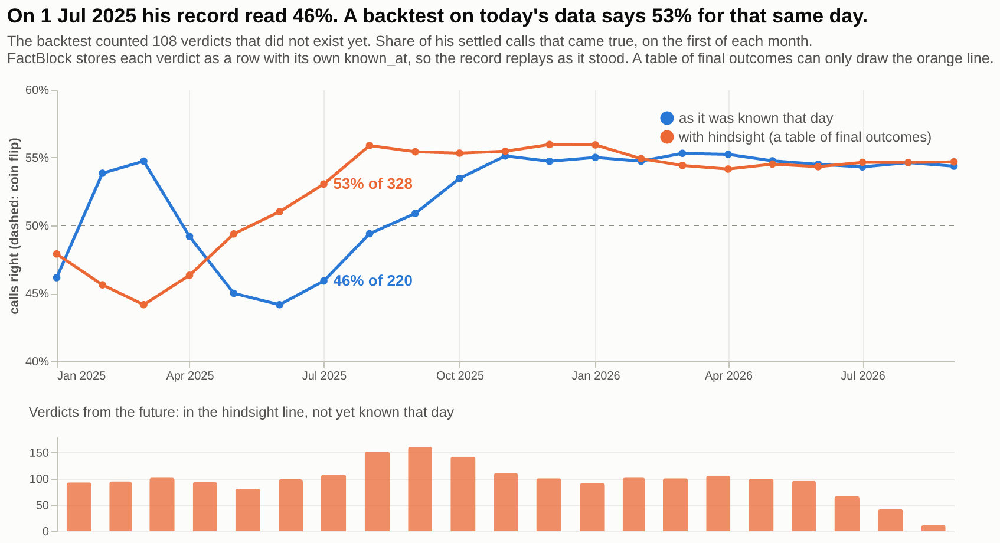
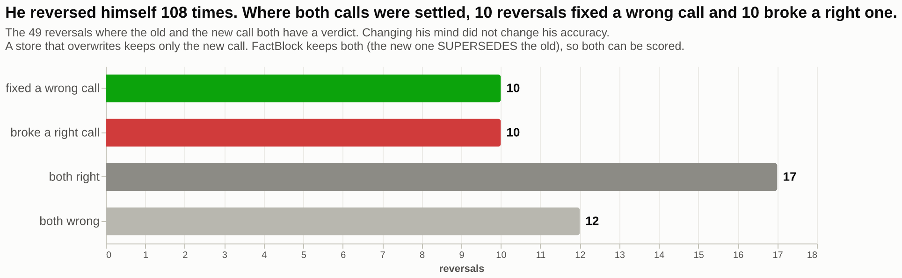
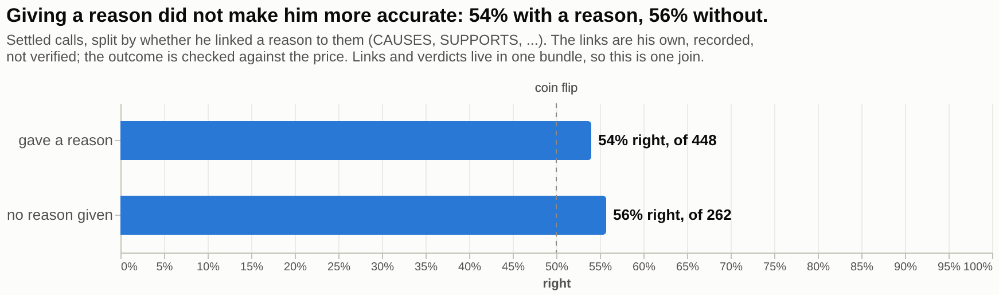
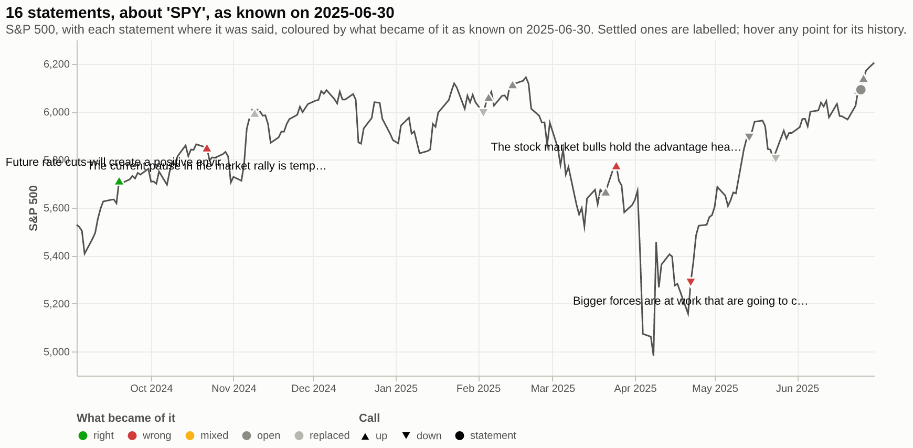

# Backtest what someone said, without hindsight

Two years of Jim Cramer's calls on CNBC ([`samples/cramer`](../../samples/cramer): 2,091 statements, 1,169 links he drew between them, 779 calls settled by the price move at their horizon), analysed in DuckDB the way time series usually are. Each chart answers a question from something a plain table of statements does not keep. The same data then becomes a model's context, and every line the model cites leads back to the recording.

```bash
git clone https://github.com/factagora/factblock && cd factblock
pip install --pre factblock duckdb vl-convert-python jupyterlab
jupyter lab examples/analysis/analysis.ipynb
```

The [notebook](analysis.ipynb) is committed with its outputs, so you can read it on GitHub without running anything. In Jupyter the charts are interactive: hover for the statement and its FactBlock id, click to open the recording.

| Time-series analysis you know | Here | What FactBlock adds |
|---|---|---|
| Backtest equity curve, look-ahead bias | 1. A selection rule run as of each call vs with hindsight | Every verdict is dated (`known_at`), so the rule reads only the record that existed when each call was made |
| Real-time data vintages vs revised series | 2. His record as it stood each month vs as it reads today | The same dates replay the record on any past day |
| Revisions and restatements | 3. Calls he later reversed, both scored | A replaced call is kept (`SUPERSEDES`), never overwritten |
| Conditioning on a feature | 4. Calls with and without a stated reason | The reasons he linked and the verdicts are in one bundle |

## 1. A rule that looks great in hindsight earns nothing extra



The rule is the kind every backtest tries: follow his calls only on subjects where his record is good (at least half of 3+ settled calls came true). Read his record from a table of final outcomes and the rule picks 209 calls at +9.3% each, almost double following everything (+5.2%). But that record includes verdicts that did not exist when each call was made. Run as of each call, with only the verdicts known before it, the same rule picks 75 calls at +4.9%: no better than following everything. The whole edge was hindsight.

## 2. His record at the time was not his record today



Every verdict is a row with its own `known_at`: the day the horizon price settled. So the record replays as it stood on any day (blue). A table that keeps only the final outcome can only draw the orange line, which scores past days with verdicts that did not exist yet. On 1 July 2025 that is 108 verdicts from the future, and 46% becomes 53%. This is the mistake the rule in chart 1 makes, seen on its own.

## 3. Changing his mind did not change his accuracy



When he turned from "avoid Oklo" (February 2025) to "Oklo is a good investment" (June 2025), the new call does not overwrite the old one: it `SUPERSEDES` it, and both stay in the bundle with their own verdicts. That is what makes the question answerable at all. A store that updates in place keeps only the latest view.

## 4. Giving reasons did not make his calls better



The reasons are the links he drew himself (`CAUSES`, `SUPPORTS`, ...), stored next to the calls and the verdicts, so this is one join. The links are **recorded, not verified**: a `CAUSES` edge says he said one thing causes another. Only the verdict is checked.

## Drill down to the statements

Every number above is made of blocks with ids and sources. Two drill-downs in the notebook show them.

**Every call on the market, over the market**, with [`factblock.timeline`](../../README.md#timelines), the library's reusable view: each call on the S&P 500 where it was said, coloured by what became of it, the settled ones labelled. Read as of 30 June 2025, so nothing later is drawn. The index comes from FRED at run time; it is licensed, so it is not in the repository.



**What one call rested on**: "The stock market is positioned to move higher" (21 March 2025), the reasons he gave and the follow-up that did not come true.


## Then ask a model

The notebook asks "Is Cramer bullish on the stock market right now, and why?" as of 24 March 2025. `factblock.context(..., ids=True)` gives the model only what was known that day, one line per statement with its id. The model cites ids, and the notebook prints each cited statement with its quote and the link to the recording. Set `OPENAI_API_KEY` or `GEMINI_API_KEY` for a real answer; without one, the notebook shows the prompt the model would get.

The same call reads differently two weeks later. On 26 March, "the bulls hold the advantage heading into April" is an open call. On 10 April it has ended, settled as **did not** on 3 April. Nothing was edited in between: a verdict row became visible.

## How it is built

| Piece | What it does |
|---|---|
| [`views.py`](views.py) | The analysis. `backtest()`, `track_record()`, `reversals()` and `reasons()` (the findings) and `evidence()` (a drill-down; the other one is `factblock.timeline`) run SQL in DuckDB over the Parquet profile and the macro pack ([`duckdb/factblock.sql`](../../duckdb/factblock.sql)). Each returns `{"view", "title", "as_of", "rows", "spec"}`: the title is the finding, the rows carry the FactBlock ids behind each mark, and the spec is Vega-Lite over those rows. Nothing renders here. |
| Rendering | The caller's choice. Jupyter renders the spec as is. A web page passes it to vega-embed. A chat answer turns it into a PNG with `vl_convert.vegalite_to_png(spec)`. `views.pick(question)` chooses the view a question needs: why → evidence, follow or backtest → backtest, change → timeline, overall → track record. |
| `factblock.context(ids=True)` | The model's context, from the same bundle and the same as-of rule. |

The as-of rule is the same in both readers: `tests/test_duckdb.py` checks that the SQL macros and the Python library return the same rows, replacements, certificates and verdicts, and `tests/test_analysis_example.py` checks these views against the library.

**Recorded is not verified.** A `CAUSES` edge in this bundle says that Cramer said one thing causes another. The charts label links as recorded and colour statements only by verdicts, which here are mechanical: the sign of the price move at the call's horizon.

## Use your own data

Each view needs one thing from your data: the backtest needs verdict rows whose `value` holds the call's `return` (as `samples/cramer` has), the track record needs verdict rows, reversals need `replaces`, reasons need links, and the timeline needs only statements (a `direction` column draws calls as up or down triangles over a series). Start from [`template.csv`](template.csv):

```
id,kind,said_at,due,text,asset,direction,speaker,source,replaces,target,outcome,decided_at
c1,prediction,2026-01-05,2026-03-31,Acme shares rise through Q1.,ACME,up,Ana,https://example.com/notes/1,,,,
c2,prediction,2026-02-10,2026-04-30,Acme shares fall after the guidance cut.,ACME,down,Ana,https://example.com/notes/2,c1,,,
,,,,,,,,,,c2,came_true,2026-05-01
```

```bash
factblock import my-calls.csv --backfill -o my-brain/
```

Set `BRAIN = "my-brain"` in the notebook and run it again. With the template you get the track record, one reversal and the timeline for ACME. Reasons and the evidence view need links: they come from `factblock extract` on the transcripts, or from `edges.jsonl` rows you write yourself.
