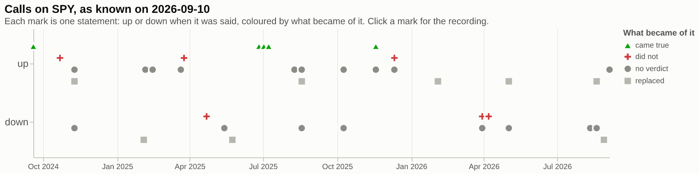
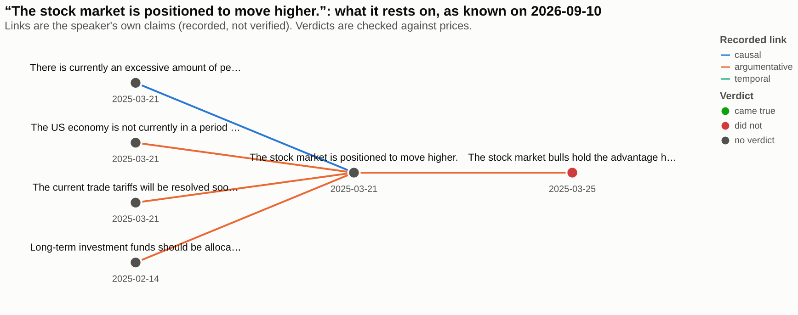
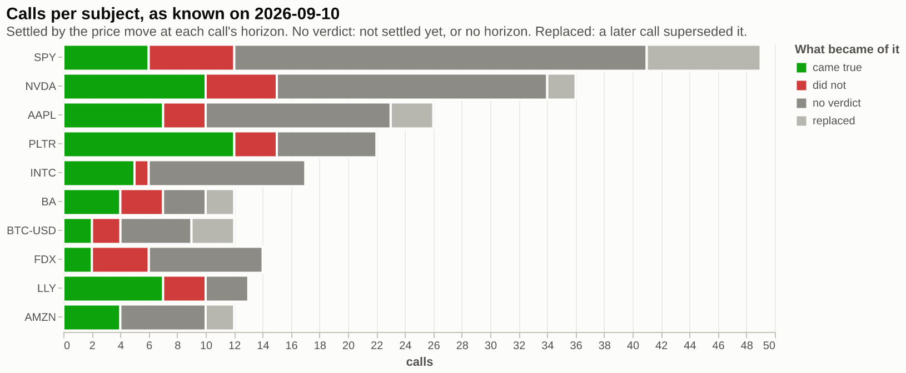

# Analyse a bundle, then hand the same data to an AI

One bundle, used twice: as a table you query and chart, and as the context a model answers from. Every mark on every chart and every line in the model's context carries a FactBlock id that leads back to the recording it came from.

The data is [`samples/cramer`](../../samples/cramer): two years of Jim Cramer's calls on CNBC, 2,091 statements, 1,169 links he drew between them, and 779 calls settled by the price move at their horizon.

```bash
git clone https://github.com/factagora/factblock && cd factblock
pip install --pre factblock duckdb vl-convert-python jupyterlab
jupyter lab examples/analysis/analysis.ipynb
```

The [notebook](analysis.ipynb) is committed with its outputs, so you can read it on GitHub without running anything. In Jupyter the charts are interactive: hover a mark for the statement and its id, click to open the recording at the second it was said.

## Three questions, three views

**How did his view on the market change?** Every call on SPY, up or down, at the day it was said, coloured by what became of it.



**What did one call rest on?** "The stock market is positioned to move higher" (21 March 2025): the reasons he gave on the left, what he said next on the right. The links are his own, **recorded, not verified**. Only the verdict colours are checked.



**Where does he stand overall?** Calls per subject: came true, did not, no verdict yet, replaced by a later call.



## Then ask a model

The notebook asks "Is Cramer bullish on the stock market right now, and why?" as of 24 March 2025. `factblock.context(..., ids=True)` gives the model only what was known that day, one line per statement with its id. The model cites ids, and the notebook prints each cited statement with its quote and the link to the recording. Set `OPENAI_API_KEY` or `GEMINI_API_KEY` for a real answer; without one, the notebook shows the prompt the model would get.

The same call reads differently two weeks later. On 26 March, "the bulls hold the advantage heading into April" is an open call. On 10 April it has ended, settled as **did not** on 3 April. Nothing was edited in between: a verdict row became visible.

## How it is built

| Piece | What it does |
|---|---|
| [`views.py`](views.py) | The analysis. `stance()`, `evidence()` and `status()` run SQL in DuckDB over the Parquet profile and the macro pack ([`duckdb/factblock.sql`](../../duckdb/factblock.sql)). Each returns `{"view", "title", "as_of", "rows", "spec"}`: rows with the FactBlock ids and source URLs behind each mark, and a Vega-Lite spec over those rows. Nothing renders here. |
| Rendering | The caller's choice. Jupyter renders the spec as is. A web page passes it to vega-embed. A chat answer turns it into a PNG with `vl_convert.vegalite_to_png(spec)`. `views.pick(question)` chooses the view a question needs: why → evidence, change → stance, overall → status. |
| `factblock.context(ids=True)` | The model's context, from the same bundle and the same as-of rule. |

The as-of rule is the same in both readers: `tests/test_duckdb.py` checks that the SQL macros and the Python library return the same rows, replacements, certificates and verdicts, and `tests/test_analysis_example.py` checks these views against the library.

**Recorded is not verified.** A `CAUSES` edge in this bundle says that Cramer said one thing causes another. The charts label links as recorded and colour statements only by verdicts, which here are mechanical: the sign of the price move at the call's horizon.

## Use your own data

The views need predictions with a subject (`asset`) and a direction (`up` or `down`). Verdicts, replacements and links are optional. Start from [`template.csv`](template.csv):

```
id,kind,said_at,due,text,asset,direction,speaker,source,replaces,target,outcome,decided_at
c1,prediction,2026-01-05,2026-03-31,Acme shares rise through Q1.,ACME,up,Ana,https://example.com/notes/1,,,,
c2,prediction,2026-02-10,2026-04-30,Acme shares fall after the guidance cut.,ACME,down,Ana,https://example.com/notes/2,c1,,,
,,,,,,,,,,c2,came_true,2026-05-01
```

```bash
factblock import my-calls.csv --backfill -o my-brain/
```

Set `BRAIN = "my-brain"` in the notebook and run it again. Expect the stance chart for your subject and the status bars. The evidence view needs links: they come from `factblock extract` on the transcripts, or from `edges.jsonl` rows you write yourself.
